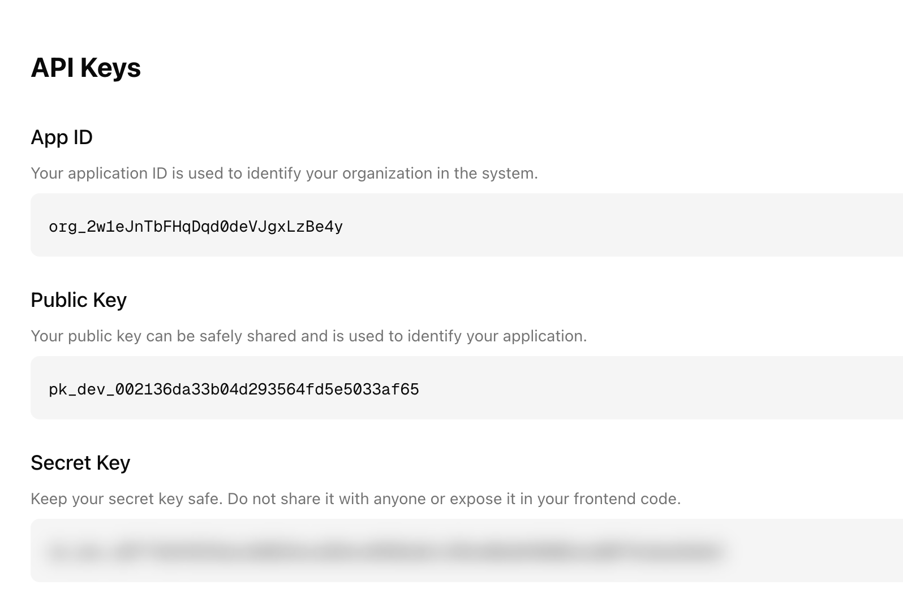

## Install the SDK

<CodeGroup>

```bash npm
npm install @chipi-pay/chipi-sdk
```
```bash yarn
yarn add @chipi-pay/chipi-sdk
```

</CodeGroup>

## Create your Organization in our Dashboard to get your keys

<CardGroup cols={6}>
  <Card
    title="Go to Dashboard"
    icon="rocket"
    href="https://dashboard.chipipay.com/"
  >
    Get your keys and some statistics from your app.
  </Card>
</CardGroup>

### Get your API Keys

Once you have registered and logged into the dashboard, go to the **Configure** tab. There you will find your **App ID**, **Public Key**, and **Secret Key**. 

  

> **Note:** Keep your Secret Key safe and never share it or expose it in your frontend code.

## Setup the Provider

The first step is to wrap your application with the `ChipiProvider` component. This provider initializes the SDK and makes all the hooks available throughout your application.

Create a providers file (e.g., `app/providers.tsx` for Next.js):

```tsx
// app/providers.tsx

// Initialize SDK
import { ChipiProvider } from "@chipi-pay/chipi-sdk";

const CHIPI_PUBLIC_KEY = process.env.NEXT_PUBLIC_CHIPI_PUBLIC_KEY!;
const CHIPI_APP_ID = process.env.NEXT_PUBLIC_CHIPI_APP_ID!;
const CHIPI_SECRET_KEY = process.env.CHIPI_SECRET_KEY!;

if (!CHIPI_PUBLIC_KEY || !CHIPI_APP_ID || !CHIPI_SECRET_KEY) {
  throw new Error("Some Key is not set");
}

export function Providers({ children }: { children: React.ReactNode }) {
  return (
    <ChipiProvider
      config={{
        apiKey: "CHIPI_PUBLIC_KEY",
        secretKey: "CHIPI_SECRET_KEY",
        appId: "CHIPI_APP_ID"
      }}
    >
      {children}
    </ChipiProvider>
  );
}
```

Then import and use this provider in your layout file (e.g., `app/layout.tsx` for Next.js):

```tsx
// app/layout.tsx
import { Providers } from './providers';

export default function RootLayout({
  children,
}: {
  children: React.ReactNode;
}) {
  return (
    <html lang="en">
      <body>
        <Providers>
          {children}
        </Providers>
      </body>
    </html>
  );
}
```

This setup:
1. Initializes the SDK with our Avnu Paymaster Provider
2. Connects to StarkNet Mainnet via our RPC endpoint
3. Makes all Chipi SDK hooks available throughout your application
4. Sets up the wallet management infrastructure

## Additional Steps

1. **Obtain Your OAuth Provider API Keys**  
   We recommend [Clerk](https://clerk.com/) or a similar service to streamline social login with providers like Google, X, or Meta. Once configured, you can pass user tokens to the Chipi SDK for invisible wallet creation.


## Wanna Deep Dive?

Expand your knowledge with these resources:

<CardGroup cols={2}>
  <Card
    title="Learn to Ship Your First Smart Contract"
    icon="rocket"
    href="https://docs.starknet.io/quick-start/overview/"
  >
    Get a quick introduction to building on StarkNet.
  </Card>
  <Card
    title="Sponsor Transactions"
    icon="hand-holding-dollar"
    href="https://doc.avnu.fi/avnu-paymaster/overview"
  >
    Discover how to cover users' gas fees with Avnu's paymaster.
  </Card>
  <Card
    title="Set Up Clerk + Next.js"
    icon="users"
    href="https://clerk.com/docs/quickstarts/nextjs"
  >
    Seamlessly integrate social login into your Next.js project.
  </Card>
  <Card
    title="See Our Live Demo"
    icon="eye"
    href="https://chipi-sdk-clerk-demo.vercel.app/"
  >
    Check out a full example of the Chipi SDK in action.
  </Card>
</CardGroup>
